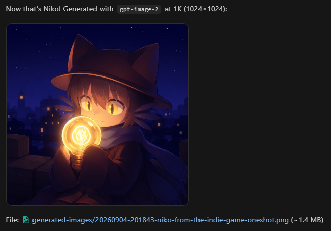

# image-gen — ZCode skill (including BYOK support)

Generate images inside ZCode with `grok-imagine-image` (xAI) or `gpt-image-1` (OpenAI) through a zero-dependency Node script (Node 18+, no npm install). ZCode's model config is text-output only, so this skill shells out to the providers' images APIs and saves PNGs locally.


^ just an example! support real artists :3 

## Install

Copy or clone this folder into your user-scope skills directory:

- Windows: `C:\Users\<you>\.zcode\skills\image-gen`
- macOS/Linux: `~/.zcode/skills/image-gen`

Restart ZCode. The skill then triggers on "generate/draw an image" requests. Optionally copy `commands/image.md` into `~/.zcode/commands/` for an explicit `/image <prompt>` command.

## Configure keys

Create a `.env` file next to `SKILL.md` (plain env vars also work and take priority):

```
XAI_API_KEY=xai-...
OPENAI_API_KEY=sk-...
# optional — gateway/aggregator base URLs (must include /v1):
# XAI_BASE_URL=https://gateway.example/v1
# OPENAI_BASE_URL=https://gateway.example/v1
# optional — default model overrides:
# XAI_IMAGE_MODEL=grok-imagine-image-quality
```

## Usage

```bash
node scripts/generate-image.mjs "a cat in a spacesuit" --provider grok
node scripts/generate-image.mjs "minimal logo" --provider openai --size 1536x1024 --quality high
node scripts/generate-image.mjs "make the background night" --provider openai --edit input.png
node scripts/generate-image.mjs "test" --dry-run   # print request, send nothing
```

The script prints one JSON object: `{"ok": true, "path": "...", "bytes": N}` or `{"ok": false, "error": "..."}`. Images save to `./generated-images/<timestamp>-<slug>.png` relative to the current working directory (override with `--out`).

## Model notes

- Model priority: `--model ID` > `XAI_IMAGE_MODEL` / `OPENAI_IMAGE_MODEL` env > built-in default.
- Grok: txt2img only — xAI's public API has no image-edit (img2img) endpoint, and rejects `--size`/`--quality`.
- OpenAI: txt2img + img2img (`/images/edits` via `--edit`).
- Video models (`grok-imagine-video*`) are out of scope — different endpoint and response format.
